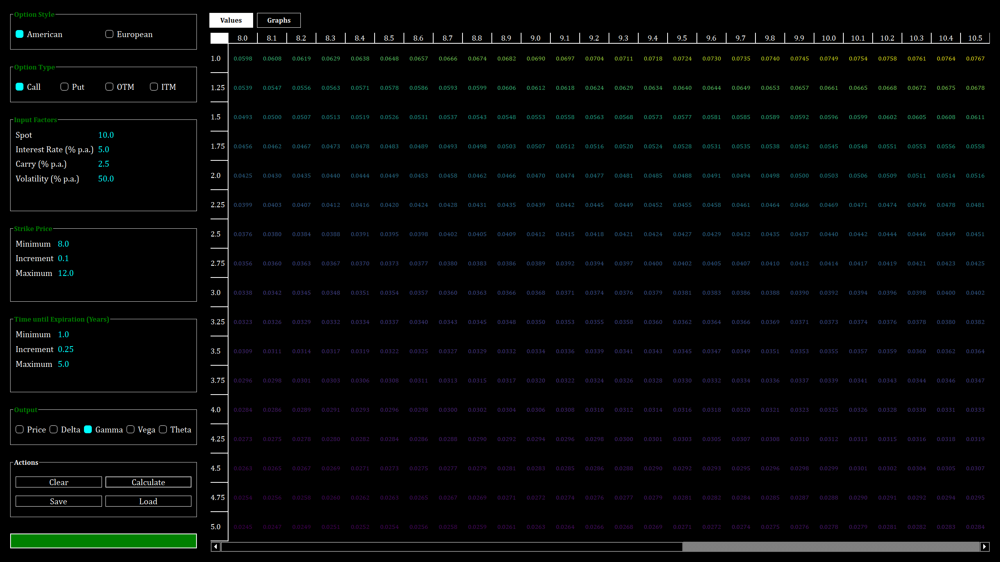

# DeriVAT (Derivative Visual Analysis Tool)
Desktop application for theoretical visualization of financial derivatives, using PyQT, Cython, and OpenGL.





## Getting Started

To run the application, 

1.Verify working installation of *Python 2.7* with *pip* and (optionally) *virtualenv* packages installed
2. Clone the repository
   ```shell
   $ git clone https://github.com/rwev/derivat.git
   ```
3. Navigate to the repository with CLI
    ```shell
   $ cd derivat
   ```
4. Create an isolated virtual environment (optional, but recommended)
   ```shell
   $ virtualenv <name>
   ```
   This is to mitigate version conflicts with the global system Python installation. This project intentionally relies on some former package versions.
5. Install dependencies

   **Windows:**

   *PyQt4*: download the Windows wheel (*.whl*) file [here](https://www.lfd.uci.edu/~gohlke/pythonlibs/#pyqt4) (be sure to select *cp27* for Python 2.7) and and manually install:
   ```shell
   \derivat > pip install PyQt4-4.11.4-cp27-<bit-system>.whl
   ```
   All other dependencies can be automatically installed with
   ```shell
   \derivat > pip install -r requirements.txt
   ```
   **Linux:**
   ```shell
   /derivat $ sudo apt-get install python-qt4 python-qt4-gl python-tk
   /derivat $ pip install -r requirements.txt --user
   ```
6. Compile Cython valuation module with the following command. 
    ```shell
    /derivat $ python ./components/libs/setup.py build_ext --inplace
    ```
    **Note**: On Windows, this step requires a working installation of [VCforPython27, Microsoft Visual C++ Compiler for Python 2.7](https://www.microsoft.com/EN-US/DOWNLOAD/DETAILS.ASPX?ID=44266) 

7. Execute
   ```shell
   /derivat $ python derivat.py 
   ```
### Controls

The 3D visualization on the **Graphs** tab can be manipulated with the following interactions:
   - **Left button drag**: Rotates the scene around central focus point
   - **Middle button drag**: Pan the scene by moving the central look-at point within the x-y plane
   - **Middle button drag + CTRL**: Pan the scene by moving the central look-at point along the z axis
   - **Wheel spin**: zoom in/out
   - **Wheel + CTRL**: change field-of-view angle


## Contribution

To-date development has been done exclusively in Visual Studio Code, with the assistance of a custom execute-on-change tool [resurgence.py](https://gist.github.com/rwev/cb5d117c9dbe0efb923e4bb1ed3619f0). 

### Setting up Resurgence.py

```javascript
    {
        "name": "Python: Resurgence",
        "type": "python",
        "request": "launch",
        "program": "${path}/resurgence.py",
        "args": [
            "--cwd",
            "--extensions=*.py",
            "--dirs=./components", 
            "--command=${path}/derivat/python.exe derivat.py"
        ],
    }
```

While running this configuration, a change of one of the *.py* source files in the project directory or the *components/* subdirectories will restart the program execution (*python derivat.py*). See *python resurgence.py --help* or read the source for more details on this mechanism. 

Resurgence shortens the change feedback loop in the development in GUI'd programs like *derivat* by forcefully However, debugging with *resurgence.py* isn't possible, because it spawns a child process.  

### Debug Configuration 

To debug *derivat*, specify a debug configuration that starts execution directly.

```javascript
        {
            "name": "Python: derivat",
            "type": "python",
            "request": "launch",
            "program": "${workspaceFolder}/derivat.py"
        }
```


